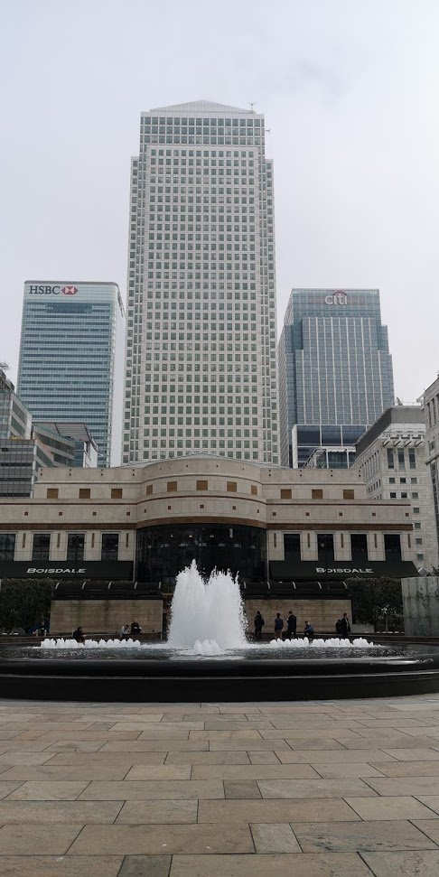
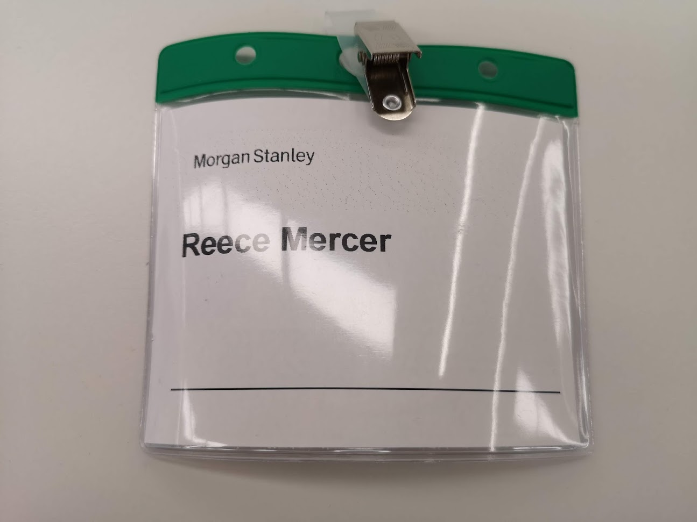
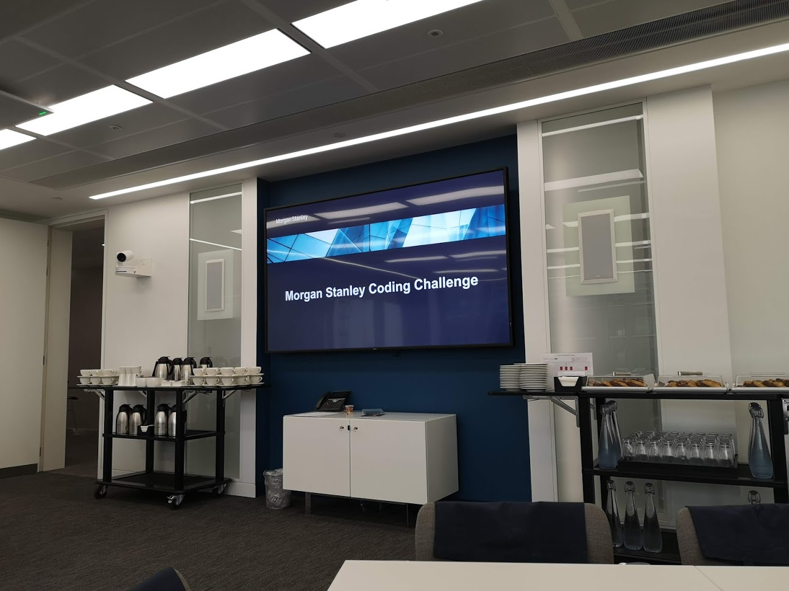
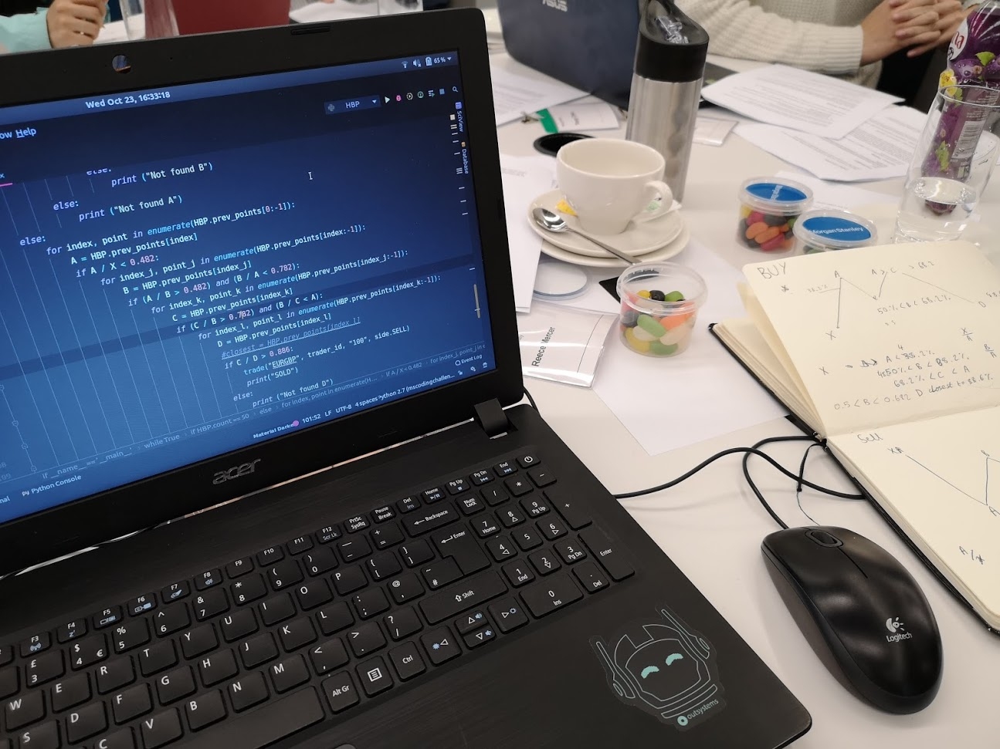

## My first hackathon!

I have never attended any hackathons before, which I guess is a weird thing for a computer science student. However, I was passed on details of a mini-hackathon (done in a day) that was taking place at the Morgan Stanley offices in Canary Wharf by a friend, and I signed up. Due to MS being quite a high profile company for university students, I wasn't expecting to get a place, but soon I received an email confirming my place and a few days later, I found myself on a train down to Canada Water.

This was also my first time in Canary Wharf, and all I thought when I got there was just 'wow'. Huge tower blocks for literally every bank you can imagine just surround you in all directions.




After grabbing some lunch I headed into the office block to meet some of the other students I'd be working with for the day. After a short amount of time we were lead upstairs, given some badges and introduced to the staff and given a short intro about life at Morgan Stanley.





The task was based around the foreign exchange (FX) market. The MS team running the event that day had set up a web server running on AWS. This server mimicked the real world FX market. Prices fluctuated against one another, and also changed in response to various political and economics news stories that were released over the course of the day. You could send HTTP requests to certain endpoints, and receive information back (in JSON) regarding your current account balance and the current trading price of various currency pairs. 

The goal? In a team, come up with the most effective automated trading algorithm you can. The team who has made the most profit by the end of the day wins. I was on a team with a maths with computing student as well as a physics student. Being the less mathsy of the two and the one who had prior experience using the requests library we were given in a Python stub to start with, I was delegated as the software engineer - implementing and helping bring to fruition some trading strategies put together by the maths heads on my team. 

You can see below the skeleton we were given to begin with: 

```python
import json
import requests
import time
import random

url = "an ec2 instance that no longer exists:5108"

def get_price(product):
  api_url = url + "/price/" + product
  resp = requests.get(api_url)
  if resp.status_code == 200:
      return json.loads(resp.content.decode('utf-8'))["price"]
  return None

# trade("EURGBP", trader_id, "1", side.BUY)
def trade(product, trader_id, qty, side):
    api_url = url + "/trade/" + product
    data = {"trader_id":trader_id, "quantity":qty, "side":side}
    resp = requests.post(api_url, json=data)
    if resp.status_code == 200:
        resp_json = json.loads(resp.content.decode('utf-8'))
        if resp_json["success"]:
            return resp_json["price"]
    return None

def getEURPositions(trader_id):
    api_url = url + "/positions/" + trader_id
    resp = requests.get(api_url)
    if resp.status_code == 200:
        return json.loads(resp.content.decode('utf-8'))["EUR"]
    return None

def getGBPPositions(trader_id):
    api_url = url + "/positions/" + trader_id
    resp = requests.get(api_url)
    if resp.status_code == 200:
        return json.loads(resp.content.decode('utf-8'))["GBP"]
    return None

if __name__ == '__main__':
  current_gbp = 1000000
  current_eur = 0
  # Keep track of positions after trading
  trader_id = "X1rgrthvkPm2Qzkyukywfe5SEzpU5I"
  print ("trader ID is: " + trader_id)

  current_gbp = getGBPPositions(trader_id)
  current_eur = getEURPositions(trader_id)

  print("EUR: {} GBP: {}".format(current_eur, current_gbp))
```

After mucking around with some naive approaches using simple averages, we eventually settled on using [harmonic bat patterns](https://www.investopedia.com/articles/forex/11/harmonic-patterns-in-the-currency-markets.asp) to try and speculate whether to buy or sell a certain currency pair. They can get fairly complex, but the basic idea is built around something called the Fibonacci Sequence - 0, 1, 1, 2, 3, 5, 8, 13, 21, 34 ... each next sequence member is equal to the sum of the previous two.

By taking one sequence number (say 21) and dividing it by the next member of the sequence, you get the **Fibionacci Ratio**, which is approximately equal to 0.618. This number occurs in an abundance of uncanny places in the world. Take a sunflower, for example. Over the course of its evolutionary history, the sunflower has evolved to grow its seeds in tightly clustered spirals.


But, the interesting thing here is that in order to maximise the number of seeds it can hold in these clusters, the sunflower has evolved towards a 0.618 degree rotation between each seed pod. The golden ratio is fundamental to the sunflower's reproductive success. There is a cool interacive example of this on [mathsisfun.com](https://www.mathsisfun.com/numbers/nature-golden-ratio-fibonacci.html) that you can try to see this for yourselves.

Anyway enough about flowers. The point is that this occurs in nature, in man-made structures, and most importantly of all in this case, financial markets. By using certain patterns that occur in market graphs, you can combine them with Fibonacci ratios to essentially predict future movements. I won't get in to the nitty gritty details here because I'm still not 100% certain of how it works myself. If you want to read more though, [this investopedia article](https://www.investopedia.com/articles/forex/11/harmonic-patterns-in-the-currency-markets.asp) covers the essentials.

The code we created to try and make use of these patterns was a mess. Be warned. It's hard to code nicely when you're new to a topic and under time and competitive stress :) So here goes...


```Python 
if __name__ == '__main__':
    current_gbp = 1000000
    current_eur = 0
    # Keep track of positions after trading
    trader_id = "X19F5yfKlkPm2QzHlaeP3Dwi5SEzpU5I"
    print ("trader ID is: " + trader_id)
    while True:
        current_gbp = getGBPPositions(trader_id)
        current_eur = getEURPositions(trader_id)

        print("EUR: {} GBP: {}".format(current_eur, current_gbp))

        curr = get_price("EURGBP")
        HBP.prev_points.append(curr)
        HBP.count += 1
        if HBP.count == 50:

            HBP.count = 0
            X = HBP.prev_points[0]

            if X < HBP.prev_points[1]:
                for index, point in enumerate(HBP.prev_points[0:-1]):
                    A = HBP.prev_points[index]
                    for index_j, point_j in enumerate(HBP.prev_points[index:-1]):
                        B = HBP.prev_points[index_j]
                        if (B / A > 0.482) and (B / A < 0.882):
                            for index_k, point_k in enumerate(HBP.prev_points[index_j:-1]):
                                C = HBP.prev_points[index_k]
                                if (B / C > 0.882) and (B / C < A):
                                    for index_l, point_l in enumerate(HBP.prev_points[index_k:-1]):
                                        D = HBP.prev_points[index_l]
                                        #closest = HBP.prev_points[index_l]
                                        if D / C > 0.782:
                                            trade("EURGBP", trader_id, "50000", side.BUY)
                                            print("BUY")
                                        else:
                                            print ("Not found D")
                                else:
                                    print ("Not found C")
                            else:
                                print ("Not found B")

            else:
                for index, point in enumerate(HBP.prev_points[0:-1]):
                    A = HBP.prev_points[index]
                    for index_j, point_j in enumerate(HBP.prev_points[index:-1]):
                        B = HBP.prev_points[index_j]
                        if (A / B > 0.482) and (B / A < 0.882):
                            for index_k, point_k in enumerate(HBP.prev_points[index_j:-1]):
                                C = HBP.prev_points[index_k]
                                if (C / B > 0.882) and (B / C < A):
                                    for index_l, point_l in enumerate(HBP.prev_points[index_k:-1]):
                                        D = HBP.prev_points[index_l]
                                        #closest = HBP.prev_points[index_l]
                                        if C / D > 0.782:
                                            trade("EURGBP", trader_id, "50000", side.SELL)
                                            print("SOLD")
                                        else:
                                            print ("Not found D")
                                else:
                                    print ("Not found C")
                        else:
                            print ("Not found B")


            del(HBP.prev_points[0])
            HBP.prev_points.append(get_price("EURGBP"))
```

Yeah. It's as bad as it looks. We didn't win. But we also didn't come last either which is the upside.




Overall - a fun day of learning and meeting new people. I had a brief bit of networking with the lovely folks at MS before I left and got chatting about their competition with other banks around the world in the automative trading space. Interesting stuff. Definitely looking into more hackathons in the future now though. Getting thrown out of your comfort zone every now and then is more than beneficial in a field like computer science.

Thanks MS! 


